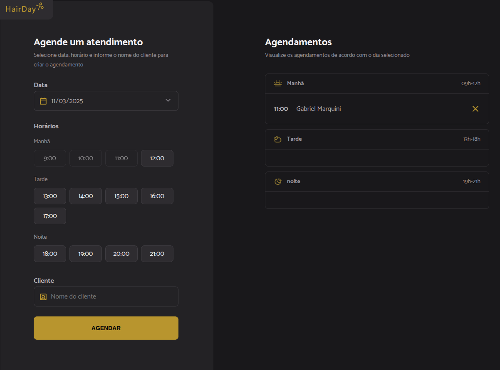

# Sistema de Agendamento

Um projeto web que permite agendar horários de forma dinâmica, com gerenciamento de disponibilidade em tempo real.  
O sistema foi desenvolvido com foco em **organização, interatividade e integração com API REST simulada via JSON Server**, proporcionando uma experiência de uso fluida e intuitiva.

## 📋 Funcionalidades

- **Seleção de data**  
  O usuário escolhe uma data através de um campo de calendário (`input type="date"`).

- **Exibição de horários disponíveis**  
  Os horários são carregados dinamicamente a partir de um arquivo JavaScript (`opening-hours.js`), que define os períodos de funcionamento.  
  O sistema bloqueia automaticamente horários passados e já agendados.

- **Criação de agendamento**  
  O usuário pode selecionar um horário disponível, inserir seu nome e confirmar o agendamento.  
  As informações são salvas na API simulada (`JSON Server`).

- **Cancelamento de agendamento**  
  É possível remover um agendamento existente. O sistema atualiza automaticamente a lista de horários disponíveis.

- **Atualização dinâmica**  
  As informações da tela são atualizadas em tempo real, sem necessidade de recarregar a página.

---

## ⚙️ Tecnologias Utilizadas

### **Frontend**

- **HTML5** – Estrutura semântica e limpa, com uso de `<input type="date">` e listas dinâmicas.
- **CSS3** – Estilização responsiva e organizada, seguindo boas práticas de design moderno.
- **JavaScript (ES6+)** –
  - Uso de módulos (`import/export`)
  - Manipulação direta do DOM
  - Funções assíncronas (`async/await`)
  - Consumo de API REST com `fetch()`
  - Controle de datas e horários com **Day.js**

### **Backend (simulado)**

- **JSON Server** – Cria uma API REST fake a partir de um arquivo JSON, simulando operações de:
  - `GET` – listar agendamentos
  - `POST` – criar novo agendamento
  - `DELETE` – remover agendamento

### **Ferramentas de Desenvolvimento**

- **Node.js** – Ambiente de execução JavaScript.
- **Webpack** – Empacotamento e otimização do código em ambiente de desenvolvimento.
- **Babel** – Transpilação de código ES6+ para compatibilidade com navegadores.

---
